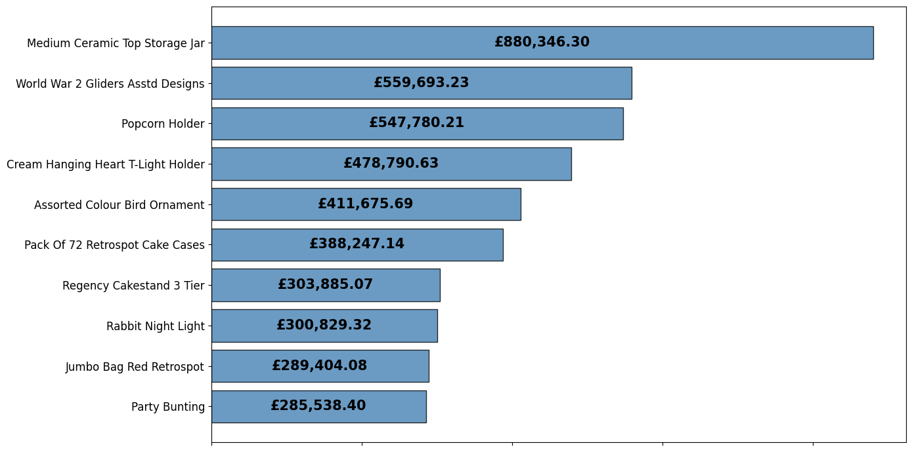
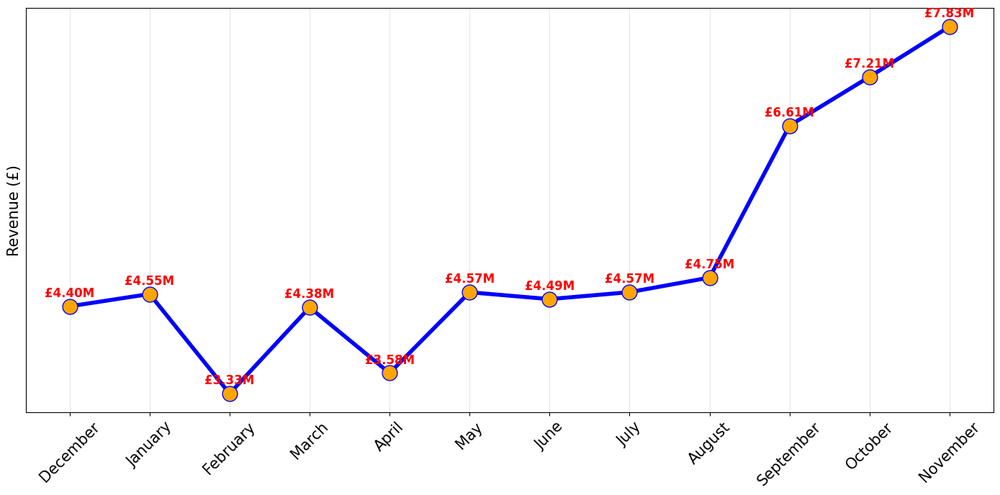
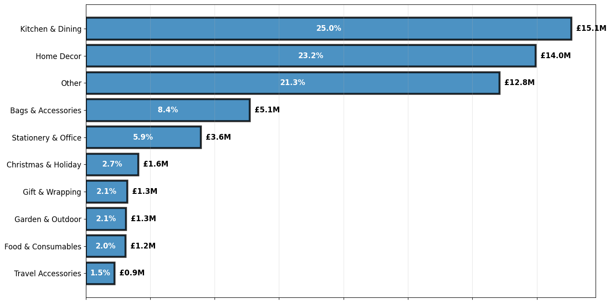
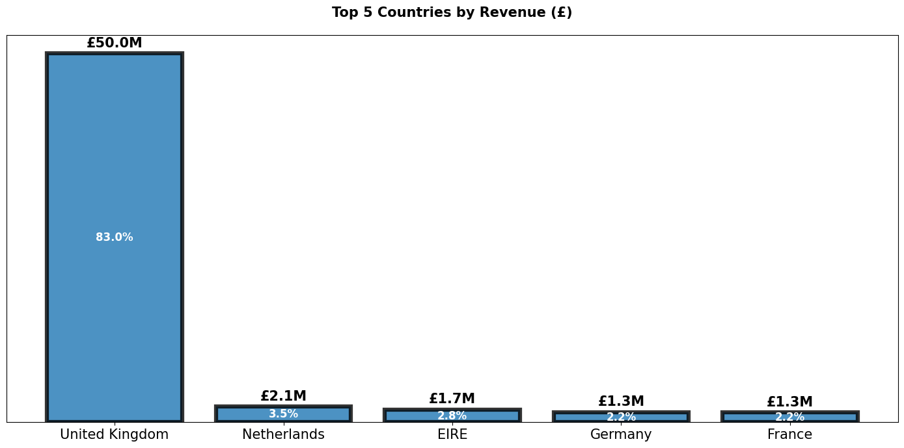
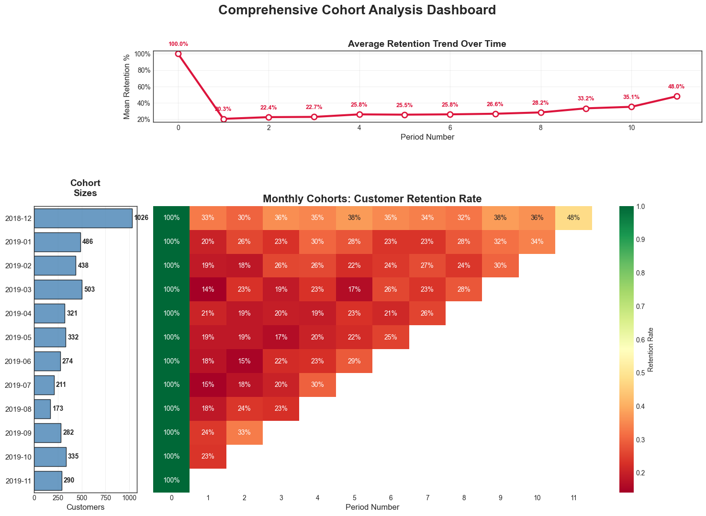

# E-commerce Sales Transactions Analysis
This is a sales transaction public available dataset of UK-based e-commerce (online retail) for one year.  
This shop has been selling gifts and homewares for adults and children through the website since 2007.

## Project Summary
This project analyzes a random year of UK e-commerce transactions to uncover:   
1) Customer behavior ➡️ customer segmentation based on Recency-Frequency-Monetary (RFM)  
2) Product trends ➡️ market basket analysis  
3) Opportunities for business growth ➡️ cohort analysis  
This analysis reveal key drivers of revenue, retention, and product associations. 

## Project Structure

### Table of Contents
1. 🔍 **[ Dataset](#-dataset)** - Data source
2. 🧹 **[ Data Preprocessing](#-data-preprocessing)** - Cleaning and feature engineering
3. 📊 **[ Exploratory Data Analysis](#-exploratory-data-analysis-eda)** - Key insights and patterns
4. 👥 **[ Customer Segmentation](#-customer-segmentation)** - RFM Analysis and Pareto Principle
5. 🧩 **[ Customer Retention Analysis](#-customer-retention-analysis)** - Cohort analysis
6. 🛒 **[ Market Basket Analysis](#-market-basket-analysis)** - Product associations rules and cross-selling
7. 💡 **[ Business Recommendations](#-business-recommendations)** - Actionable insights and strategies
8. 🚀 **[ Future Enhancements](#-future-enhancements)** - Next steps and improvements
9. 🔁 **[ Reproducibility](#-reproducibility)** - Install dependencies

## 🔍 Dataset
I used the Kaggle API (Program > kaggle_data_download.py) to automatically load the dataset.  
Navigate to the [ Reproducibility](#-reproducibility) for more details regarding Kaggle API.  
More info about data is available at the following link.  
- *[📥 Download Source](https://www.kaggle.com/datasets/gabrielramos87/an-online-shop-business)*

## 🧹 Data Preprocessing
1. **Data Cleaning**: Filtered cancelled transactions (~1.6%), removed duplicates (<1%), handled missing values  
2. **Feature Engineering**: Created revenue calculations (+ log-transformed), date components and metrics for visualisations  
3. **Create Categories**: Created categories using regex patterns 

## 📊 Exploratory Data Analysis (EDA)

### Key insights
- **Recorded period**: 2018-12-01 to 2019-11-30 (Removed 2019-12 because the dataset did not contain the whole month)
- **Total Revenue**: £60,269,235
- **Total Customers**: 4,671
- **Geographic Concentration**: UK represents 83% of total revenue
- **Seasonal Patterns**: September/October/November show peak revenue performances
- **Customer Behavior**: Friday/Sunday emerge as the highest revenue days
- **Transaction Volume**: Average of 278 items per transaction indicates bulk purchasing
- **Most Customers buy bulk** (70.6% of customers buy more than 100 products per order on average)

### Bulk vs Retail Customers
- **Retail Customers** : 1373 (AVG Quantity Per Transaction <= 100)
- **Bulk Customers** : 3298 (AVG Quantity Per Transaction > 100)

### Top Revenue Generators
- **Top 10 Products by Revenue (£)**

- **Monthly Revenue Trend (£)**

- **Revenue Trend by Day of Week (£)**

- **Top 10 Product Categories by Revenue (£)**

- **Top 5 Countries by Revenue (£)**

## 👥 Customer Segmentation

### RFM Analysis
Customers were segmented using RFM analysis (Recency, Frequency, Monetary) with each variable devided into 5 equal size parts to identify distinct behavioral groups:

- **VIP Customers**: High-value, frequent, recent purchasers ➡️ Those who belonged to the top parts (4th and 5th)
- **Loyal Customers**: Consistent engagement and spending
- **At Risk**: Previously valuable customers showing declining activity
- **New Customers**: Recent acquisitions

### Customer Distribution by Segement

- **Pareto Principle**: VIP customers alone (20%) generates ~61% of total revenue
- **Top 3 segments** generate 80.7% of total revenue

## 🧩 Customer Retention Analysis 

### Cohort Analysis
**Cohort analysis groups customers by the month they first made a purchase and tracks how many return in later months.**  
**This helps measure monthly customer retention and spot seasonal patterns**

#### Retention Insights
**We don't include the first month in our cohort analysis because our dataset only covers one full year.**
**Including the first month would give incomplete retention results, since we can't track earlier activity or repeat purchases from before the dataset starts.**

**First Month Dropoff:**
   - Average first-month retention: 20.3%  

### Average Retention Rate per Month

**Top 3 months for retention :**  
   - September: 24.1%
   - October: 23.3%
   - April: 20.6%

**Bottom 3 months for retention :**  
   - March: 14.1%
   - June: 17.5%
   - July: 14.7%

### Insights
- **We can recognize a big dropoff on the first month (79.7%) which probably correlates to the fact that most customers buy bulk.**
- **We can see a clear seasonal pattern of customer retention:**
    - Summer months seem to be the worst for retention due to the holiday season (June, July).
    - Retention increases from September, likely with the start of the academic year. 

## 🛒 Market Basket Analysis
**Market basket analysis looks at customer purchase data to find out which products are often bought together.**

### Key metrics
- **Support:**  measures how common is the pairing of products A and B
- **Confidence:** measures how likely is product B bought when product A is bought
- **Lift:** measures how much does product A boost the chances of product B being bought compared to random

**Highlights**
- **Transactions with at lest two items:** 17527 | 92.4% of total transactions
- **Average basket size**: 26.2 items

**Top 5 Product Associations (by Lift):**
1) Herb Marker Thyme → Herb Marker Rosemary | Lift: 71.19 | Conf: 93.4%
2) Herb Marker Rosemary → Herb Marker Thyme | Lift: 71.19 | Conf: 93.0%
3) Herb Marker Chives → Herb Marker Parsley | Lift: 71.07 | Conf: 92.4%
4) Herb Marker Chives → Herb Marker Thyme | Lift: 69.98 | Conf: 91.4%
5) Regency Tea Plate Pink → Regency Tea Plate Green | Lift: 43.85 | Conf: 91.2%

**Top 5 Product Associations (by Support):**
1) Jumbo Bag Pink Polkadot → Jumbo Bag Red Retrospot | Support: 4.69% | Count: 812
2) Jumbo Bag Red Retrospot → Jumbo Bag Pink Polkadot | Support: 4.69% | Count: 812
3) Green Regency Teacup And Saucer → Roses Regency Teacup And Saucer | Support: 4.26% | Count: 737
4) Roses Regency Teacup And Saucer → Green Regency Teacup And Saucer | Support: 4.26% | Count: 737
5) Jumbo Storage Bag Suki → Jumbo Bag Red Retrospot | Support: 4.05% | Count: 701

## 💡 Business Recommendations
1. **Customer Engagement**: 
- Launch targeted retention campaigns for "At Risk" customers
- Offer exclusive deals or perks to VIP customers to encourage loyalty
2. **Product Bundling**: 
- Develop and promote bundles featuring top-performing product pairs identified through market basket analysis
3. **Market Expansion**: 
- Explore marketing strategies and tailored offers for high-potential European countries to diversify revenue streams
4. **Seasonal Planning**: 
- Align inventory and promotions prior to peak sales periods (e.g., October for November)
- Scale back marketing spend and inventory during low-activity summer months to control costs

## 🚀 Future Enhancements
- **Advanced Category Creation**: Create product categories using NLP
- **Predictive Modeling**: Predict customer value and churn
- **Real-time Analytics**: Add interactive dashboards for performance monitoring
- **Advanced Segmentation**: Machine learning algorithms for clustering or classification 
- **Time series models**: Predict the next purchase move of VIP customers for strategic marketing

## 🔁 Reproducibility
#### 1. Clone repo and cd
git clone https://github.com/Papagiannopoulos/ecommerce-business-analytics.git   
cd 'ecommerce-business-analytics'

#### 2. Create a fresh virtual [env](https://github.com/astral-sh/uv)
uv venv  
**Note**: If uv is not already installed, run the following command in PowerShell.  
- On macOS and Linux:  
curl -LsSf https://astral.sh/uv/install.sh | sh  
- On Windows:  
powershell -ExecutionPolicy ByPass -c "irm https://astral.sh/uv/install.ps1 | iex"

#### 3. Kaggle's API  
1) Create a [Kaggle account](https://www.kaggle.com)  
2) Go to Account Settings and click "Create New API Token" to download the kaggle.json file  
3) Navigate to C:\Users\<your_user_name> on your computer  
4) Create a new folder named .kaggle  
5) Move the downloaded kaggle.json file into the .kaggle folder

#### 4. Sync environment
uv sync  
**Note**: At this step, Microsoft Visual C++ is required. If sync crashes follow the provided steps.

#### 5. You are ready!!!
